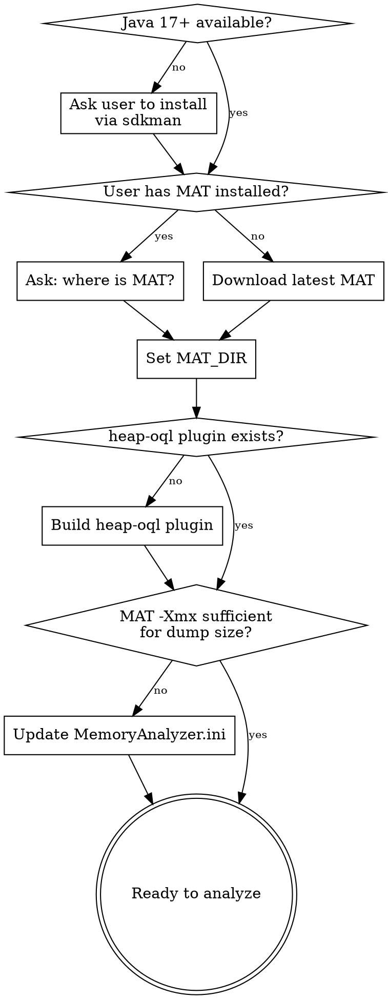

# Heap Dump Analyzer

Analyze Java heap dumps using Eclipse MAT and the `heap-oql` CLI plugin. Structured TSV output, fully programmable, no GUI.

## Goal

Present the user with a summary of what's consuming heap memory. The deliverable is a breakdown of top memory consumers by retained heap, with class names, instance counts, and sizes. Stop after presenting this summary and ask the user what they want to dig into next — do NOT keep running analysis unprompted.

## IMPORTANT: Do Not Search for Heap Dumps

**ASK the user for the heap dump file path.** Do not scan the filesystem looking for `.hprof` or `.hdump` files. The user knows where their dump is.

**Warn the user:** MAT creates index files (`.index`, `.threads`, `.o2c.index`, etc.) next to the dump file. These can be several GB for large dumps. Suggest the user move the dump to a scratch directory (e.g., `/tmp/heap/`) before analysis to avoid cluttering their workspace.

## Bootstrap Flow

Before any analysis, ensure the toolchain is ready. Follow this decision tree top-to-bottom — skip steps that are already satisfied.



### Step 1: Eclipse MAT + Java

Check if user already has MAT. If yes, ask for the path. If no, ask where to install it, then download.

**Detection:** Look for `MemoryAnalyzer` binary or `ParseHeapDump.sh` at a known path.

**Always download the latest MAT.** Current latest is v1.16.1 — requires **Java 17+**.

**Download URLs (v1.16.1):**

| Platform | URL |
|----------|-----|
| Linux x86_64 | `https://download.eclipse.org/mat/1.16.1/rcp/MemoryAnalyzer-1.16.1.20250109-linux.gtk.x86_64.zip` |
| Linux aarch64 | `https://download.eclipse.org/mat/1.16.1/rcp/MemoryAnalyzer-1.16.1.20250109-linux.gtk.aarch64.zip` |
| macOS x86_64 | `https://download.eclipse.org/mat/1.16.1/rcp/MemoryAnalyzer-1.16.1.20250109-macosx.cocoa.x86_64.zip` |
| macOS aarch64 | `https://download.eclipse.org/mat/1.16.1/rcp/MemoryAnalyzer-1.16.1.20250109-macosx.cocoa.aarch64.zip` |

```bash
# Example: Linux x86_64
cd <install_dir>
curl -LO https://download.eclipse.org/mat/1.16.1/rcp/MemoryAnalyzer-1.16.1.20250109-linux.gtk.x86_64.zip
unzip MemoryAnalyzer-*.zip
MAT_DIR="<install_dir>/mat"
```

**Java 17+ required.** Check with `java -version`. If missing or too old, install via sdkman:

```bash
# Install sdkman if not present
curl -s "https://get.sdkman.io" | bash
source "$HOME/.sdkman/bin/sdkman-init.sh"

# Install Java 17 (or latest LTS)
sdk install java 17.0.13-tem
```

Ask the user to run the sdkman commands themselves (interactive shell required).

### Step 2: Build heap-oql Plugin

Check: `ls $MAT_DIR/plugins/org.heapoql_*.jar && ls $MAT_DIR/heap-oql`

If missing, create source files, compile, package, and register. Full source is in [HeapOQLApp.java](#heapoqlappjava-source) below.

```bash
# 1. Create source tree
mkdir -p "$MAT_DIR/plugins/heap-oql/src/org/heapoql"
mkdir -p "$MAT_DIR/plugins/heap-oql/META-INF"
mkdir -p "$MAT_DIR/plugins/heap-oql/bin"

# 2. Write HeapOQLApp.java (see source below)
# 3. Write plugin.xml (see below)
# 4. Write MANIFEST.MF (see below)

# 5. Compile
javac -d "$MAT_DIR/plugins/heap-oql/bin" \
  -cp "$(echo $MAT_DIR/plugins/org.eclipse.mat.api_*.jar):$(echo $MAT_DIR/plugins/org.eclipse.mat.report_*.jar):$(echo $MAT_DIR/plugins/org.eclipse.equinox.app_*.jar):$(echo $MAT_DIR/plugins/org.eclipse.equinox.common_*.jar):$(echo $MAT_DIR/plugins/org.eclipse.osgi_*.jar):$(echo $MAT_DIR/plugins/org.eclipse.core.runtime_*.jar)" \
  "$MAT_DIR/plugins/heap-oql/src/org/heapoql/HeapOQLApp.java"

# 6. Package JAR
cd "$MAT_DIR/plugins/heap-oql"
jar cfm ../org.heapoql_1.0.0.jar META-INF/MANIFEST.MF -C bin . plugin.xml

# 7. Register bundle in OSGi
echo "org.heapoql,1.0.0,plugins/org.heapoql_1.0.0.jar,4,false" >> \
  "$MAT_DIR/configuration/org.eclipse.equinox.simpleconfigurator/bundles.info"

# 8. Force OSGi to discover new bundle (one-time)
"$MAT_DIR/MemoryAnalyzer" -clean -consolelog -nosplash -application org.heapoql.app 2>&1 | head -5

# 9. Create wrapper script
cat > "$MAT_DIR/heap-oql" << 'WRAPPER'
#!/bin/sh
MAT_DIR="$(dirname -- "$0")"
exec "$MAT_DIR/MemoryAnalyzer" -consolelog -nosplash -application org.heapoql.app "$@" 2>/tmp/heap-oql-stderr.log
WRAPPER
chmod +x "$MAT_DIR/heap-oql"
```

### Step 3: Auto-Size MAT Heap

MAT needs sufficient `-Xmx` to parse the dump. Rule of thumb: **dump_size_GB * 2.5**, minimum 4 GB.

```bash
# Get dump size in bytes
DUMP_SIZE=$(stat -c%s "$DUMP_FILE" 2>/dev/null || stat -f%z "$DUMP_FILE")
# Calculate Xmx in MB (2.5x dump size, min 4096)
XMX_MB=$(python3 -c "print(max(4096, int($DUMP_SIZE / 1024 / 1024 * 2.5)))")

# Read current Xmx from ini
CURRENT_XMX=$(grep -oP '(?<=-Xmx)\d+' "$MAT_DIR/MemoryAnalyzer.ini")

if [ "$CURRENT_XMX" -lt "$XMX_MB" ]; then
  sed -i "s/-Xmx${CURRENT_XMX}m/-Xmx${XMX_MB}m/" "$MAT_DIR/MemoryAnalyzer.ini"
  echo "Updated MAT heap: ${CURRENT_XMX}m -> ${XMX_MB}m"
fi
```

**Also update ParseHeapDump.sh** if using report mode — it reads its own `-Xmx` from `MemoryAnalyzer.ini`.

## Analysis Workflow

Once bootstrap is complete, analyze the dump in phases. Each phase narrows focus.

### Phase 1: Reports (High-Level Overview)

**First, check if index files already exist** next to the dump (e.g., `<dump>.index`, `<dump>.threads`). If they exist, the dump was already parsed — skip straight to Phase 2 with `heap-oql` which will reuse the indexes. Only run ParseHeapDump if no indexes exist yet.

```bash
# Check for existing indexes
ls <dump>.index 2>/dev/null && echo "Indexes exist — skip to Phase 2"

# Only if no indexes: generate reports (also creates indexes)
$MAT_DIR/ParseHeapDump.sh <dump> org.eclipse.mat.api:suspects
$MAT_DIR/ParseHeapDump.sh <dump> org.eclipse.mat.api:top_components
```

Reports are HTML, written next to the dump file. Read them to identify dominant classes.

**Index creation takes ~10-30 min for large dumps.** Once created, all subsequent commands (reports and heap-oql) reuse them instantly.

### Phase 2: Class Histogram

```bash
heap-oql <dump> histogram <pattern>
# TSV: class_name  instance_count  shallow_heap  retained_heap
```

Pattern matches via regex OR substring. Use `.*` for everything.

### Phase 3: Instance List

```bash
heap-oql <dump> instances <fully.qualified.ClassName>
# TSV: object_id  address  shallow_heap  retained_heap  display_name
```

Includes subclasses. Sorted by retained heap descending.

### Phase 4: Field Inspection

```bash
heap-oql <dump> fields <fully.qualified.ClassName>
# TSV: address  retained_heap  field1  field2  ...
```

### Phase 5: OQL Queries

```bash
heap-oql <dump> oql "SELECT OBJECTS s FROM java.lang.String s WHERE s.count > 100"
# TSV: object_id  class  address  shallow_heap  retained_heap  display_name
```

**Always use `SELECT OBJECTS`** for CLI — produces full TSV. Plain `SELECT` returns a structured result that can't be rendered as TSV.

## Memory Sizing Calculations

### Per-Entry Cost (Generic Method)

1. Find a representative collection instance via `heap-oql instances`
2. Divide `retained_heap` by entry count → per-entry bytes
3. Verify with `heap-oql fields` to read the `size` field

### HashMap<String, String> Reference

| Component | Bytes |
|-----------|-------|
| HashMap.Node | 32 |
| Key String + byte[] | 40 + ceil(keyLen/8)*8 |
| Value String + byte[] | 40 + ceil(valLen/8)*8 |
| Bucket pointer (amortized) | ~8 |
| **Typical (short strings)** | **~120-150/entry** |

### Cache Replacement Overhead

When old and new cache coexist during refresh:
```
peak_memory = steady_state * 2.1   (old + new + resize overhead)
heap_needed = entries * bytes_per_entry * 2.1 + other_usage + GC_headroom
```

GC headroom: 1.5-2x live data for G1GC.

## Quick Reference

| Task | Command |
|------|---------|
| Leak suspects | `ParseHeapDump.sh <dump> org.eclipse.mat.api:suspects` |
| Top consumers | `ParseHeapDump.sh <dump> org.eclipse.mat.api:top_components` |
| Class histogram | `heap-oql <dump> histogram <pattern>` |
| List instances | `heap-oql <dump> instances <class>` |
| Field values | `heap-oql <dump> fields <class>` |
| OQL query | `heap-oql <dump> oql "SELECT OBJECTS ..."` |

All `heap-oql` output is TSV on stdout. stderr goes to `/tmp/heap-oql-stderr.log`.

## Common Mistakes

- **`SELECT` vs `SELECT OBJECTS`** — use `SELECT OBJECTS` for TSV output
- **Unquoted OQL** — shell splits on spaces; always double-quote the query
- **Insufficient MAT heap** — check/update `-Xmx` in `MemoryAnalyzer.ini` (Step 3)
- **Plugin not found after install** — must run once with `-clean` flag AND add to `bundles.info`
- **grep aliased to rg** — use `/usr/bin/grep -E` when piping with `|` alternation patterns

---

## HeapOQLApp.java Source

Full source for the heap-oql Eclipse application plugin.

```java
package org.heapoql;

import org.eclipse.equinox.app.IApplication;
import org.eclipse.equinox.app.IApplicationContext;
import org.eclipse.mat.SnapshotException;
import org.eclipse.mat.snapshot.ISnapshot;
import org.eclipse.mat.snapshot.SnapshotFactory;
import org.eclipse.mat.snapshot.model.IClass;
import org.eclipse.mat.snapshot.model.IObject;
import org.eclipse.mat.snapshot.model.FieldDescriptor;
import org.eclipse.mat.util.IProgressListener;
import org.eclipse.mat.util.VoidProgressListener;
import org.eclipse.mat.snapshot.IOQLQuery;
import org.eclipse.mat.snapshot.OQLParseException;

import java.io.File;
import java.util.*;

public class HeapOQLApp implements IApplication {

    @Override
    public Object start(IApplicationContext context) throws Exception {
        String[] args = (String[]) context.getArguments().get("application.args");

        if (args == null || args.length < 2) {
            printUsage();
            return IApplication.EXIT_OK;
        }

        String dumpPath = args[0];
        String mode = args[1];

        File dumpFile = new File(dumpPath);
        if (!dumpFile.exists()) {
            System.err.println("ERROR: Dump file not found: " + dumpPath);
            return IApplication.EXIT_OK;
        }

        IProgressListener listener = new VoidProgressListener();
        ISnapshot snapshot = null;

        try {
            System.err.println("Opening snapshot: " + dumpPath);
            snapshot = SnapshotFactory.openSnapshot(dumpFile, new HashMap<>(), listener);
            System.err.println("Snapshot opened: " + snapshot.getSnapshotInfo().getUsedHeapSize() + " bytes, "
                    + snapshot.getSnapshotInfo().getNumberOfObjects() + " objects");

            switch (mode) {
                case "oql":
                    if (args.length < 3) {
                        System.err.println("ERROR: oql mode requires a query string");
                        printUsage();
                        break;
                    }
                    String query = String.join(" ", Arrays.copyOfRange(args, 2, args.length));
                    runOQL(snapshot, query);
                    break;

                case "histogram":
                    String pattern = args.length >= 3 ? args[2] : ".*";
                    runHistogram(snapshot, pattern);
                    break;

                case "instances":
                    if (args.length < 3) {
                        System.err.println("ERROR: instances mode requires a class name");
                        break;
                    }
                    runInstances(snapshot, args[2]);
                    break;

                case "fields":
                    if (args.length < 3) {
                        System.err.println("ERROR: fields mode requires a class name");
                        break;
                    }
                    runFields(snapshot, args[2]);
                    break;

                default:
                    System.err.println("ERROR: Unknown mode: " + mode);
                    printUsage();
            }

        } catch (Exception e) {
            System.err.println("ERROR: " + e.getMessage());
            e.printStackTrace(System.err);
        } finally {
            if (snapshot != null) {
                SnapshotFactory.dispose(snapshot);
            }
        }

        return IApplication.EXIT_OK;
    }

    private void runOQL(ISnapshot snapshot, String queryStr) throws Exception {
        System.err.println("Running OQL: " + queryStr);
        IOQLQuery query = SnapshotFactory.createQuery(queryStr);
        Object result = query.execute(snapshot, new VoidProgressListener());

        if (result instanceof int[]) {
            int[] objectIds = (int[]) result;
            System.out.println("object_id\tclass\taddress\tshallow_heap\tretained_heap\tdisplay_name");
            for (int id : objectIds) {
                IObject obj = snapshot.getObject(id);
                long retained = snapshot.getRetainedHeapSize(id);
                long address = snapshot.mapIdToAddress(id);
                String displayName = obj.getClassSpecificName();
                System.out.println(id + "\t"
                        + obj.getClazz().getName() + "\t"
                        + "0x" + Long.toHexString(address) + "\t"
                        + obj.getUsedHeapSize() + "\t"
                        + retained + "\t"
                        + (displayName != null ? displayName : ""));
            }
            System.err.println("Total: " + objectIds.length + " objects");
        } else if (result instanceof IOQLQuery.Result) {
            System.out.println("Structured result returned. Use int[]-returning queries for tabular output.");
        } else if (result != null) {
            System.out.println(result.toString());
        } else {
            System.out.println("(no results)");
        }
    }

    private void runHistogram(ISnapshot snapshot, String pattern) throws Exception {
        System.err.println("Histogram for pattern: " + pattern);
        System.out.println("class_name\tinstance_count\tshallow_heap\tretained_heap");

        Collection<IClass> allClasses = snapshot.getClasses();
        List<long[]> rows = new ArrayList<>();
        List<String> names = new ArrayList<>();

        for (IClass clazz : allClasses) {
            if (clazz.getName().matches(pattern) || clazz.getName().contains(pattern)) {
                int[] objectIds = clazz.getObjectIds();
                long shallowTotal = 0;
                long retainedTotal = 0;
                for (int id : objectIds) {
                    IObject obj = snapshot.getObject(id);
                    shallowTotal += obj.getUsedHeapSize();
                    retainedTotal += snapshot.getRetainedHeapSize(id);
                }
                names.add(clazz.getName());
                rows.add(new long[]{objectIds.length, shallowTotal, retainedTotal});
            }
        }

        Integer[] indices = new Integer[rows.size()];
        for (int i = 0; i < indices.length; i++) indices[i] = i;
        Arrays.sort(indices, (a, b) -> Long.compare(rows.get(b)[2], rows.get(a)[2]));

        for (int idx : indices) {
            long[] r = rows.get(idx);
            System.out.println(names.get(idx) + "\t" + r[0] + "\t" + r[1] + "\t" + r[2]);
        }
        System.err.println("Total: " + names.size() + " classes matched");
    }

    private void runInstances(ISnapshot snapshot, String className) throws Exception {
        System.err.println("Instances of: " + className);
        System.out.println("object_id\taddress\tshallow_heap\tretained_heap\tdisplay_name");

        Collection<IClass> classes = snapshot.getClassesByName(className, true);
        if (classes == null || classes.isEmpty()) {
            System.err.println("Class not found: " + className);
            return;
        }

        List<long[]> rows = new ArrayList<>();
        List<String[]> meta = new ArrayList<>();

        for (IClass clazz : classes) {
            int[] objectIds = clazz.getObjectIds();
            for (int id : objectIds) {
                IObject obj = snapshot.getObject(id);
                long retained = snapshot.getRetainedHeapSize(id);
                long address = snapshot.mapIdToAddress(id);
                String displayName = obj.getClassSpecificName();
                rows.add(new long[]{id, address, obj.getUsedHeapSize(), retained});
                meta.add(new String[]{displayName != null ? displayName : ""});
            }
        }

        Integer[] indices = new Integer[rows.size()];
        for (int i = 0; i < indices.length; i++) indices[i] = i;
        Arrays.sort(indices, (a, b) -> Long.compare(rows.get(b)[3], rows.get(a)[3]));

        for (int idx : indices) {
            long[] r = rows.get(idx);
            System.out.println(r[0] + "\t0x" + Long.toHexString(r[1]) + "\t" + r[2] + "\t" + r[3] + "\t" + meta.get(idx)[0]);
        }
        System.err.println("Total: " + rows.size() + " instances");
    }

    private void runFields(ISnapshot snapshot, String className) throws Exception {
        System.err.println("Fields for instances of: " + className);

        Collection<IClass> classes = snapshot.getClassesByName(className, false);
        if (classes == null || classes.isEmpty()) {
            System.err.println("Class not found: " + className);
            return;
        }

        boolean headerPrinted = false;

        for (IClass clazz : classes) {
            int[] objectIds = clazz.getObjectIds();

            for (int id : objectIds) {
                IObject obj = snapshot.getObject(id);
                long retained = snapshot.getRetainedHeapSize(id);

                if (!headerPrinted) {
                    StringBuilder header = new StringBuilder("address\tretained_heap");
                    List<FieldDescriptor> fields = clazz.getFieldDescriptors();
                    for (FieldDescriptor fd : fields) {
                        header.append("\t").append(fd.getName());
                    }
                    System.out.println(header.toString());
                    headerPrinted = true;
                }

                StringBuilder row = new StringBuilder();
                row.append("0x").append(Long.toHexString(snapshot.mapIdToAddress(id)));
                row.append("\t").append(retained);

                List<FieldDescriptor> fields = clazz.getFieldDescriptors();
                for (FieldDescriptor fd : fields) {
                    Object val = obj.resolveValue(fd.getName());
                    if (val instanceof IObject) {
                        IObject refObj = (IObject) val;
                        String name = refObj.getClassSpecificName();
                        if (name != null && name.length() < 200) {
                            row.append("\t").append(name);
                        } else {
                            row.append("\t").append(refObj.getClazz().getName()).append("@0x")
                               .append(Long.toHexString(snapshot.mapIdToAddress(refObj.getObjectId())));
                        }
                    } else if (val != null) {
                        row.append("\t").append(val);
                    } else {
                        row.append("\tnull");
                    }
                }
                System.out.println(row.toString());
            }
        }
    }

    private void printUsage() {
        System.err.println("Usage: heap-oql <dump_file> <mode> [args...]");
        System.err.println();
        System.err.println("Modes:");
        System.err.println("  oql <query>                 Run an OQL query");
        System.err.println("  histogram <class_pattern>   Show instances and retained heap for matching classes");
        System.err.println("  instances <class_name>      List instances with retained sizes (includes subclasses)");
        System.err.println("  fields <class_name>         Show field values for each instance");
    }

    @Override
    public void stop() {
    }
}
```

## plugin.xml

```xml
<?xml version="1.0" encoding="UTF-8"?>
<?eclipse version="3.2"?>
<plugin>
    <extension id="app" point="org.eclipse.core.runtime.applications">
        <application cardinality="singleton-global" thread="main" visible="true">
            <run class="org.heapoql.HeapOQLApp" />
        </application>
    </extension>
</plugin>
```

## META-INF/MANIFEST.MF

```
Manifest-Version: 1.0
Bundle-ManifestVersion: 2
Bundle-Name: Heap OQL CLI
Bundle-SymbolicName: org.heapoql;singleton:=true
Bundle-Version: 1.0.0
Require-Bundle: org.eclipse.core.runtime,
 org.eclipse.mat.api
```
