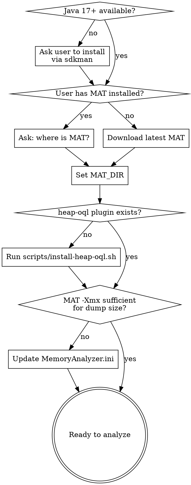

# Heap Dump Analyzer

Analyze Java heap dumps using Eclipse MAT and the `heap-oql` CLI plugin. Structured TSV output, fully programmable, no GUI.

## Goal

Present the user with a summary of what's consuming heap memory. **Always use markdown tables** to present results — not raw TSV, not bullet lists, not prose.

Example output format:
| Class | Instances | Retained Heap | % of Total |
|-------|-----------|---------------|------------|
| com.example.MyCache | 14 | 1.16 GB | 17% |

Use human-readable sizes (KB/MB/GB) and include percentage of total heap where useful.

Stop after presenting each summary and ask the user what they want to dig into next — do NOT keep running analysis unprompted.

**Drill-down flow:** The skill supports iterative breakdown. At any level, the user can ask to go deeper:

1. **Top-level:** "What's using memory?" → `histogram` or `dominators`
2. **Class-level:** "Break down HashMap" → `instances <class>`
3. **Instance-level:** "What's inside the biggest one?" → `fields <class>` or `oql`
4. **Why alive?** "Why is this HashMap retained?" → `gc_roots <class|0xaddr>`
5. **Waste analysis:** "Any wasted memory?" → `duplicates` + `collection_fill`
6. **Thread/classloader:** "What threads are running?" → `threads` or `classloaders`
7. **Custom:** "Show me all strings over 10KB" → `oql`

Each level produces a table, then stops. The user drives how deep to go.

## IMPORTANT: Do Not Search for Heap Dumps

**ASK the user for the heap dump file path.** Do not scan the filesystem looking for `.hprof` or `.hdump` files.

**Warn the user:** MAT creates index files (`.index`, `.threads`, `.o2c.index`, etc.) next to the dump file. These can be several GB for large dumps. Suggest moving the dump to a scratch directory (e.g., `/tmp/heap/`) before analysis.

## Bootstrap Flow

Before any analysis, ensure the toolchain is ready. Skip steps already satisfied.



### Step 1: Java + MAT

Check `java -version`. If missing or < 17, ask user to install via sdkman:
```bash
sdk install java 17.0.13-tem
```

Check if user has MAT. If not, download latest (v1.16.1):

| Platform | URL |
|----------|-----|
| Linux x86_64 | `https://download.eclipse.org/mat/1.16.1/rcp/MemoryAnalyzer-1.16.1.20250109-linux.gtk.x86_64.zip` |
| Linux aarch64 | `https://download.eclipse.org/mat/1.16.1/rcp/MemoryAnalyzer-1.16.1.20250109-linux.gtk.aarch64.zip` |
| macOS x86_64 | `https://download.eclipse.org/mat/1.16.1/rcp/MemoryAnalyzer-1.16.1.20250109-macosx.cocoa.x86_64.zip` |
| macOS aarch64 | `https://download.eclipse.org/mat/1.16.1/rcp/MemoryAnalyzer-1.16.1.20250109-macosx.cocoa.aarch64.zip` |

### Step 2: Install heap-oql Plugin

Check: `ls $MAT_DIR/plugins/org.heapoql_*.jar && ls $MAT_DIR/heap-oql`

If missing, run: `scripts/install-heap-oql.sh <MAT_DIR> <SKILL_DIR>`

Source files are in [references/](references/): `HeapOQLApp.java`, `plugin.xml`, `MANIFEST.MF`.

### Step 3: Auto-Size MAT Heap

Rule of thumb: **dump_size_GB * 2.5**, minimum 4 GB. Update `-Xmx` in `$MAT_DIR/MemoryAnalyzer.ini` if needed.

## Analysis Workflow

### Phase 1: Reports (High-Level)

**First check for existing index files** (`<dump>.index`). If present, skip to Phase 2.

```bash
ls <dump>.index 2>/dev/null && echo "Indexes exist — skip to Phase 2"
$MAT_DIR/ParseHeapDump.sh <dump> org.eclipse.mat.api:suspects
$MAT_DIR/ParseHeapDump.sh <dump> org.eclipse.mat.api:top_components
```

### Phase 2-5: heap-oql Commands

| Task | Command | Output |
|------|---------|--------|
| Class histogram | `heap-oql <dump> histogram <pattern>` | class, count, shallow, retained |
| List instances | `heap-oql <dump> instances <class>` | id, address, shallow, retained |
| Field values | `heap-oql <dump> fields <class>` | address, retained, field1, field2... |
| OQL query | `heap-oql <dump> oql "SELECT OBJECTS ..."` | id, class, address, shallow, retained |
| GC root path | `heap-oql <dump> gc_roots <class\|0xaddr>` | depth, class, address, shallow |
| Dominator tree | `heap-oql <dump> dominators [N]` | id, class, address, shallow, retained |
| Duplicate strings | `heap-oql <dump> duplicates [min_count]` | count, total_shallow, value |
| Collection fill | `heap-oql <dump> collection_fill <class>` | id, size, capacity, fill_ratio, retained |
| Unreachable objects | `heap-oql <dump> unreachable` | class, count, shallow |
| Thread overview | `heap-oql <dump> threads` | id, retained, thread_name, stack_depth |
| ClassLoader analysis | `heap-oql <dump> classloaders` | id, class, retained, loaded_classes |

All output is TSV on stdout. stderr goes to `/tmp/heap-oql-stderr.log`. **Always use `SELECT OBJECTS`** for OQL — plain `SELECT` can't render as TSV.

## Memory Sizing

**Per-entry cost:** Find a collection via `instances`, divide `retained_heap` by entry count. Verify with `collection_fill` for size/capacity. Use `fields` to inspect individual entries.

**Cache replacement overhead:** `peak = steady_state * 2.1` (old + new + resize). GC headroom: 1.5-2x live data for G1GC.

## Common Mistakes

- **`SELECT` vs `SELECT OBJECTS`** — use `SELECT OBJECTS` for TSV output
- **Unquoted OQL** — always double-quote the query string
- **Insufficient MAT heap** — check `-Xmx` in `MemoryAnalyzer.ini`
- **Plugin not found** — must run `install-heap-oql.sh` which handles `-clean` and `bundles.info`
- **grep aliased to rg** — use `/usr/bin/grep -E` for `|` alternation patterns
